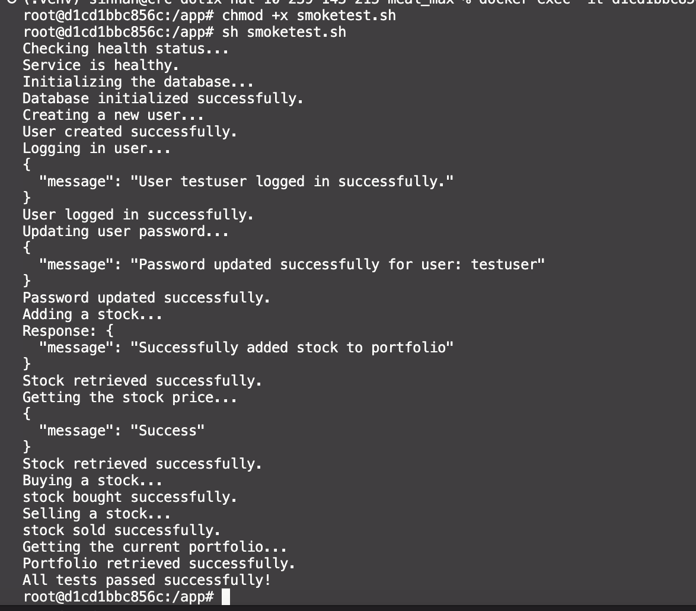

# CSFinal

Purpose of Application:
-   Provide user verification through secured salted hash passwords.
-   Allow users to view, buy, and sell their stocks.
-   Allow users to view their stock portfolio
-   Calculate a user's portfolio value upon their request

## API Documentation

## Route: `/api/stock-price`

- **Request Type:** `GET`
- **Purpose:** Allows the user to view the stock value of a given stock via its symbol.

### Request Body:
- `symbol` (String): The symbol of the stock.

### Example Request:
```json
{
  "symbol": "IBM"
}
```

### Response Format:
- **Success Response Example:**
  - **Code:** `200`
  - **Content:**
    ```json
    {
      "message": "Stock IBM is at $234 today"
    }
    ```

## Route: `/api/add-stock`

- **Request Type:** `POST`
- **Purpose:** Allows the user to buy a stock via its input symbol and the quantity of the stock.

### Request Body:
- `symbol` (String): The symbol of the stock.
- `quantity` (int): The number of stock to buy.

### Example Request:
```json
{
  "symbol": "IBM"
  "quantity": 10
}
```

### Response Format:
- **Success Response Example:**
  - **Code:** `200`
  - **Content:**
    ```json
    {
      "message": "Successfully added 10 shares of IBM"
    }
    ```

## Route: `/api/buy-stock`

- **Request Type:** `PUT`
- **Purpose:** Allows the user to buy stock via its input symbol and the quantity of the stock.

### Request Body:
- `symbol` (String): The symbol of the stock.
- `quantity` (int): The number of stock to buy.

### Example Request:
```json
{
  "symbol": "IBM"
  "quantity": 10
}
```

### Response Format:
- **Success Response Example:**
  - **Code:** `200`
  - **Content:**
    ```json
    {
      "message": "Successfully added 10 shares of IBM"
    }
    ```

## Route: `/api/delete-stock`

- **Request Type:** `POST`
- **Purpose:** Allows the user to sell stock via its input symbol and the quantity of the stock.

### Request Body:
- `symbol` (String): The symbol of the stock.
- `quantity` (int): The number of stock to sell.

### Example Request:
```json
{
  "symbol": "IBM"
  "quantity": 10
}
```

### Response Format:
- **Success Response Example:**
  - **Code:** `200`
  - **Content:**
    ```json
    {
      "message": "Successfully sold 10 shares of IBM"
    }
    ```


  
## Route: `/api/view-port`

- **Request Type:** `GET`
- **Purpose:** Allows the user to view a list of each stock of which they own shares.


### Response Format:
- **Success Response Example:**
  - **Code:** `200`
  - **Content:**
    ```json
    {
      "portfolio": [
        {
            "symbol": "AAPL",
            "name": "Apple Inc.",
            "shares": 10,
            "average_price": 150.25
        },
        {
            "symbol": "GOOGL",
            "name": "Alphabet Inc.",
            "shares": 5,
            "average_price": 2800.50
        },
        {
            "symbol": "TSLA",
            "name": "Tesla Inc.",
            "shares": 3,
            "average_price": 720.00
        }
    ]
    }
    ```
### SmokeTest
- 
